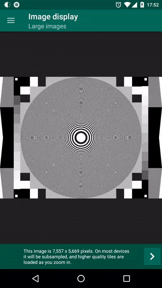

Subsampling Scale Image View
===========================

A custom image view for Android, designed for photo galleries and displaying huge images (e.g. maps and building plans) without `OutOfMemoryError`s. Includes pinch to zoom, panning, rotation and animation support, and allows easy extension so you can add your own overlays and touch event detection.

The view optionally uses subsampling and tiles to support very large images - a low resolution base layer is loaded and as you zoom in, it is overlaid with smaller high resolution tiles for the visible area. This avoids holding too much data in memory. It's ideal for displaying large images while allowing you to zoom in to the high resolution details. You can disable tiling for smaller images and when displaying a bitmap object. There are some advantages and disadvantages to disabling tiling so to decide which is best, see [the wiki](https://github.com/davemorrissey/subsampling-scale-image-view/wiki/02.-Displaying-images).

#### Guides

* [Releases & downloads](https://github.com/davemorrissey/subsampling-scale-image-view/releases)
* [Installation and setup](https://github.com/davemorrissey/subsampling-scale-image-view/wiki/01.-Setup)
* [Image display notes & limitations](https://github.com/davemorrissey/subsampling-scale-image-view/wiki/02.-Displaying-images)
* [Using preview images](https://github.com/davemorrissey/subsampling-scale-image-view/wiki/03.-Preview-images)
* [Handling orientation changes](https://github.com/davemorrissey/subsampling-scale-image-view/wiki/05.-Orientation-changes)
* [Advanced configuration](https://github.com/davemorrissey/subsampling-scale-image-view/wiki/07.-Configuration)
* [Event handling](https://github.com/davemorrissey/subsampling-scale-image-view/wiki/09.-Events)
* [Animation](https://github.com/davemorrissey/subsampling-scale-image-view/wiki/08.-Animation)
* [Extension](https://github.com/davemorrissey/subsampling-scale-image-view/wiki/10.-Extension)
* [Reference (JavaDocs)](http://davemorrissey.github.io/subsampling-scale-image-view/javadoc/)

#### Migration guides

Versions 3.9.0, 3.8.0 and 3.0.0 contain breaking changes. Migration instructions can be found [in the wiki](https://github.com/davemorrissey/subsampling-scale-image-view/wiki/X.--Migration-guides).

#### Download the sample app

[Kotlin Sample App on GitHub](https://github.com/davemorrissey/ssiv-kotlin-sample)

#### Demo

## Features

#### Image display

* Display images from assets, resources, the file system or bitmaps
* Automatically rotate images from the file system (e.g. the camera or gallery) according to EXIF
* Manually rotate images in 90° increments
* Display a region of the source image
* Use a preview image while large images load
* Swap images at runtime
* Use a custom bitmap decoder

*With tiling enabled:*

* Display huge images, larger than can be loaded into memory
* Show high resolution detail on zooming in
* Tested up to 20,000x20,000px, though larger images are slower

#### Gesture detection

* One finger pan
* Two finger pinch to zoom
* Quick scale (one finger zoom)
* Pan while zooming
* Seamless switch between pan and zoom
* Fling momentum after panning
* Double tap to zoom in and out
* Options to disable pan and/or zoom gestures

#### Animation

* Public methods for animating the scale and center
* Customisable duration and easing
* Optional uninterruptible animations

#### Overridable event detection
* Supports `OnClickListener` and `OnLongClickListener`
* Supports interception of events using `GestureDetector` and `OnTouchListener`
* Extend to add your own gestures

#### Easy integration
* Use within a `ViewPager` to create a photo gallery
* Easily restore scale, center and orientation after screen rotation
* Can be extended to add overlay graphics that move and scale with the image
* Handles view resizing and `wrap_content` layout

## Quick start

**1)** Add `com.davemorrissey.labs:subsampling-scale-image-view:3.9.0` as a dependency in your build.gradle file.

**2)** Add the view to your layout XML.

    <LinearLayout xmlns:android="http://schemas.android.com/apk/res/android"
        android:layout_width="match_parent"
        android:layout_height="match_parent" >

        <com.davemorrissey.labs.subscaleview.SubsamplingScaleImageView
            android:id="@+id/imageView"
            android:layout_width="match_parent"
            android:layout_height="match_parent"/>

    </LinearLayout>

**3a)** Now, in your fragment or activity, set the image resource, asset name or file path.

    SubsamplingScaleImageView imageView = (SubsamplingScaleImageView)findViewById(id.imageView);
    imageView.setImage(ImageSource.resource(R.drawable.monkey));
    // ... or ...
    imageView.setImage(ImageSource.asset("map.png"))
    // ... or ...
    imageView.setImage(ImageSource.uri("/sdcard/DCIM/DSCM00123.JPG"));

**3b)** Or, if you have a `Bitmap` object in memory, load it into the view. This is unsuitable for large images because it bypasses subsampling - you may get an `OutOfMemoryError`.

    SubsamplingScaleImageView imageView = (SubsamplingScaleImageView)findViewById(id.imageView);
    imageView.setImage(ImageSource.bitmap(bitmap));

## Photo credits

* San Martino by Luca Bravo, via [unsplash.com](https://unsplash.com/photos/lWAOc0UuJ-A)
* Swiss Road by Ludovic Fremondiere, via [unsplash.com](https://unsplash.com/photos/3XN-BNRDUyY)

## About

Copyright 2018 David Morrissey, and licensed under the Apache License, Version 2.0. No attribution is necessary but it's very much appreciated. Star this project if you like it!
